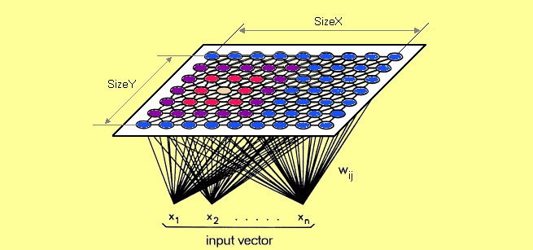

#  Credit Card Fraud Detection
Fraud Detection in Python

#### Project Overview
"Some 15.4 million consumers were victims of identity theft or fraud last year, according to a new report from Javelin Strategy & Research. That’s up 16 percent from 2015, and the highest figure recorded since the firm began tracking fraud instances in 2004."
The integrity of financial transactions is an incredibly important issue facing financial institutions and credit card companies alike. Having the ability to classify the legitimacy of a transaction to protect clients not only gives customers peace of mind, but is expensive. In 2016, according to CNBC, consumers lost more than $16B due to fraudulent transactions.

#### Project Goals

Can we use historical transaction data to predict whether a transaction is fraudulent or legitimate?

#### Data Overview

Dataset is from Kaggle(https://www.kaggle.com/mlg-ulb/creditcardfraud).
It contains transactions made by credit cards in September 2013 by european cardholders. 
This dataset presents transactions that occurred in two days, where we have 492 frauds out of 284,807 transactions. The dataset is highly unbalanced, the positive class (frauds) account for 0.172% of all transactions.
It contains only numerical input variables which are the result of a PCA transformation. Unfortunately, due to confidentiality issues, we cannot provide the original features and more background information about the data. Features V1, V2, ... V28 are the principal components obtained with PCA, the only features which have not been transformed with PCA are 'Time' and 'Amount'. Feature 'Time' contains the seconds elapsed between each transaction and the first transaction in the dataset. The feature 'Amount' is the transaction Amount, this feature can be used for example-dependant cost-senstive learning. Feature 'Class' is the response variable and it takes value 1 in case of fraud and 0 otherwise." 
### Supervised Learning
#### Classification (logistic,MNB)
#### ANN and SMOTE Sampling

### Unsupervised Learning
#### Anomaly Detection(anomalydetection.ipynb)
Anomaly detection is a technique used to identify unusual patterns that do not conform to expected behavior, called outliers. It has many applications in business, from intrusion detection (identifying strange patterns in network traffic that could signal a hack) to system health monitoring (spotting a malignant tumor in an MRI scan), and from fraud detection in credit card transactions to fault detection in operating environments.
1. Isolation Forest Anomaly Detection Algorithm
2. Density-Based Anomaly Detection (Local Outlier Factor)Algorithm
3. Support Vector Machine Anomaly Detection Algorithm
#### Auto Encoders
Autoencoders are an unsupervised learning technique in which we leverage neural networks for the task of representation learning. Specifically, we'll design a neural network architecture such that we impose a bottleneck in the network which forces a compressed knowledge representation of the original input. If the input features were each independent of one another, this compression and subsequent reconstruction would be a very difficult task. However, if some sort of structure exists in the data (ie. correlations between input features), this structure can be learned and consequently leveraged when forcing the input through the network's bottleneck.

#### Self-organising Map(som.ipynb)

Core purpose of SOM is to reduce dimentionality. The example below shows a complex data set consisting of a massive amount of columns and dimensions and demonstrates how that data set's dimensionality can be reduced. So,instead of having to deal with hundreds of rows and columns (because who would want that!), the data is processed into a simplified map; that's what we call a self-organizing map. The map provides you with a two-dimensional representation of the exact same data set; one that is easier to read.

